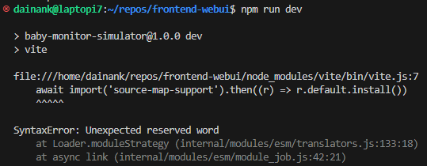

# Baby Monitor Simulator (frontend)
> Primitive frontend code for a baby monitor simulator.

## Recommended IDE Setup

[VSCode](https://code.visualstudio.com/) + [Vue - Official](https://marketplace.visualstudio.com/items?itemName=Vue.volar)

## Project Setup

- `nmp i` - Install
- `npm run dev` - Run
- `npm run build` - Compile
- `npm run test:unit` - Unit Tests
- `npm run test:e2e:dev` - E2E Tests
    - `npm run test:e2e` - E2E for Production Deployment (make sure to build)

## Node Version
> Make sure to have a modern `Node.js` version if you receive the following error:

`nvm` is a good version manager for this: https://github.com/nvm-sh/nvm?tab=readme-ov-file#installing-and-updating

Currently using: `v20.17.0`

## Docs

- [Vite](https://vitejs.dev/config/)